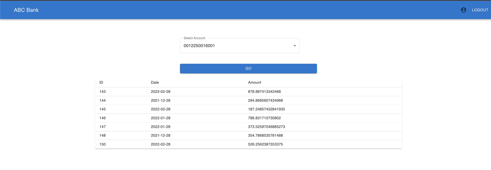
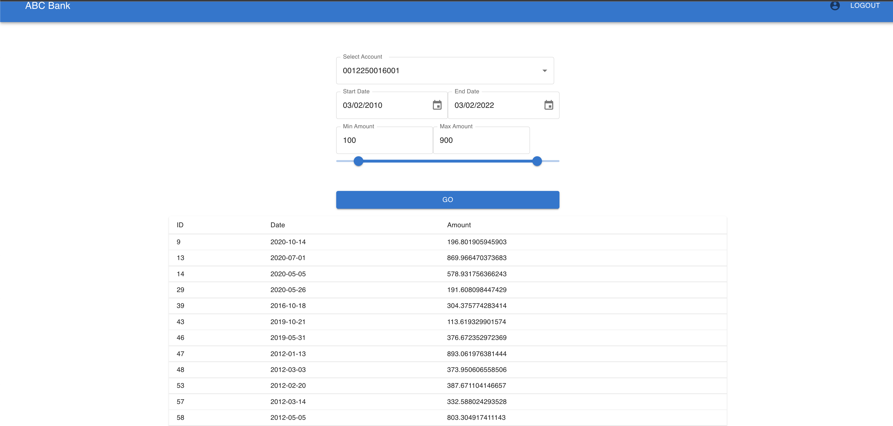

# Bank Statements APP

## Overview
Simple web application to list statements form MS Access DB

## Run App Locally
After clonning the project, please do the following steps

### Backend
[Maven](https://maven.apache.org/install.html) should be installed, then:

In backend\bank folder:

```bash
mvn clean install
mvn spring-boot:run
```
The backend default port is `8080`

In frontend\bank-ui folder:

### Frontend
[Node](https://docs.npmjs.com/downloading-and-installing-node-js-and-npm) should be installed, then
```bash
npm ci
npm run start
```

### Notes
- Default backend URL will be http://localhost:8080
- To open the frontend go to http://localhost:3000/login

## API Documentation
### API Documented using SWAGGER
http://localhost:8080/api/swagger-ui.html#/


## App Screenshots
### Login Screen


### User Home



### Admin Home

